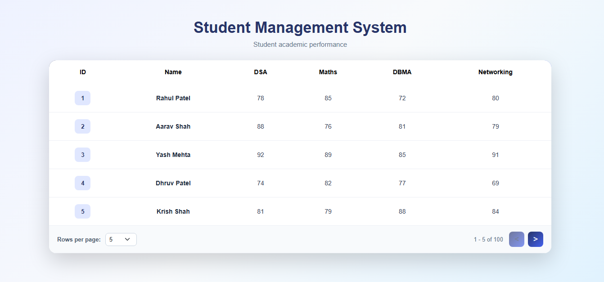

# Student Management System

A simple and responsive **Student Management System** built with
**React.js, Bootstrap, CSS, and JSON Server**.

The project fetches student academic data from a JSON Server API and
displays the records in a clean table with pagination.

------------------------------------------------------------------------

## 📸 Project Screenshot



------------------------------------------------------------------------

## 🎥 Project Demo Video

Click below to watch the complete project demonstration:

**[▶️ Watch Student Management System Demo](YOUR_VIDEO_LINK_HERE)**

> **Note:** Replace `YOUR_VIDEO_LINK_HERE` with your actual YouTube,
> Google Drive, or other video link before uploading the project to
> GitHub.

### Video Covers

-   React project structure
-   JSON Server setup
-   Student data fetching
-   Table display
-   Pagination
-   Rows-per-page selection
-   Previous and Next page buttons
-   Responsive Bootstrap layout

------------------------------------------------------------------------

## 🚀 Features

-   Fetch student data using Fetch API
-   Display student records in a table
-   Shows:
    -   ID
    -   Name
    -   DSA
    -   Maths
    -   DBMA
    -   Networking
-   Pagination support
-   Select rows per page:
    -   5
    -   10
    -   25
    -   50
    -   100
-   Previous (`<`) and Next (`>`) pagination buttons
-   Responsive Bootstrap table
-   Clean CSS design
-   Student ID badge design
-   Table hover effect

------------------------------------------------------------------------

## 🛠️ Technologies Used

-   HTML
-   CSS
-   Bootstrap
-   JavaScript
-   React.js
-   JSON Server
-   Fetch API

------------------------------------------------------------------------

## 📂 Project Structure

``` text
student-management-system/
│
├── src/
│   ├── App.jsx
│   ├── App.css
│   └── main.jsx
│
├── db.json
├── package.json
└── README.md
```

------------------------------------------------------------------------

## 🔄 Project Workflow

``` text
Start React Application
        ↓
React App Loads
        ↓
useEffect() Runs
        ↓
Fetch API Request
        ↓
http://localhost:3000/students
        ↓
JSON Server Returns Student Data
        ↓
setAllData(data)
        ↓
Student Data Stored in State
        ↓
Pagination Logic
        ↓
slice(firstIndex, lastIndex)
        ↓
Current Students Displayed
        ↓
User Changes Rows Per Page
        ↓
Table Data Updates
        ↓
User Clicks < or >
        ↓
currentData Changes
        ↓
Next / Previous Records Display
```

------------------------------------------------------------------------

## 📡 API

The project uses JSON Server.

### Endpoint

``` text
http://localhost:3000/students
```

### Example Data

``` json
{
  "id": 1,
  "name": "John",
  "dsa": 80,
  "maths": 66,
  "dbma": 76,
  "networking": 89
}
```

------------------------------------------------------------------------

## 📄 Pagination Logic

The project uses three main values for pagination:

``` js
const [currentData, setCurrentData] = useState(1);
const [perpageData, setPerpageData] = useState(5);
```

The last index is calculated using:

``` js
let lastIndex = currentData * perpageData;
```

The first index is calculated using:

``` js
let firstIndex = lastIndex - perpageData;
```

The required student records are displayed using:

``` js
let currentStudents = allData.slice(firstIndex, lastIndex);
```

Total pages are calculated using:

``` js
let totalData = Math.ceil(allData.length / perpageData);
```

------------------------------------------------------------------------

## ⚙️ How to Run

### 1. Install Dependencies

``` bash
npm install
```

### 2. Start JSON Server

``` bash
npx json-server --watch db.json
```

JSON Server will run on:

``` text
http://localhost:3000
```

### 3. Start React Application

Open another terminal and run:

``` bash
npm run dev
```

------------------------------------------------------------------------

## 🎯 Main React Concepts Used

### `useState`

Used to store:

-   All student data
-   Current page
-   Number of records per page

### `useEffect`

Used to fetch student data when the component loads.

### Fetch API

Used to communicate with JSON Server.

### `map()`

Used to display each student record inside the table.

### `slice()`

Used for pagination by displaying only the required records.

------------------------------------------------------------------------

## 📱 Responsive Design

Bootstrap's responsive table classes are used so that the table can be
viewed properly on different screen sizes.

------------------------------------------------------------------------

## 👨‍💻 Project Purpose

This project was created to practice:

-   React state management
-   API fetching
-   JSON Server
-   Table rendering
-   Pagination
-   Bootstrap
-   CSS styling

------------------------------------------------------------------------

## 📌 Conclusion

The Student Management System demonstrates how React can fetch student
data from a JSON Server API and display it in a structured and
responsive table with practical pagination functionality.
